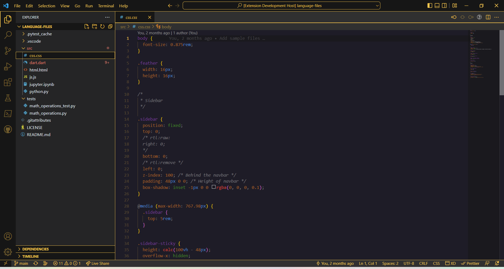

# [Colorways VS Code](https://marketplace.visualstudio.com/items?itemName=Franthormel.colorways)
A Visual Studio Code Theme inspired by Firefox Colorways.

## Screenshots

### 🍻 Cheers

Balanced 


Bold


## Availability
| Theme name (style) | Status                                                                  |
| ------------------ | ----------------------------------------------------------------------- |
| Cheers (Balanced)  | Available                                                               |
| Cheers (Bold)      | Available                                                               |
| Cheers (Soft)      | [Future work](https://github.com/franthormel/colorways-vscode/issues/4) |

## Packaging and publishing
1. Install vsce.
```
npm install -g vsce
```

2. Package files.
```
vsce package -o extensions/
```

3. Publish changes
```
vsce publish.
```

See [this guide](https://code.visualstudio.com/api/working-with-extensions/publishing-extension) for more.
